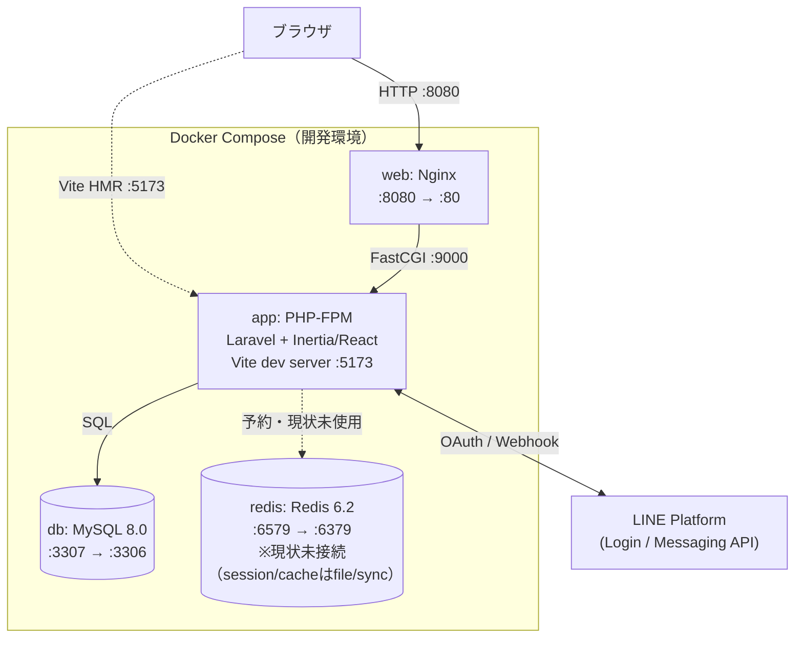

# UchiStock - 家庭在庫管理アプリ

## 概要

UchiStockは、家庭の在庫管理を効率化するためのWebアプリケーションです。

## 主要機能

- 📦 アイテム管理（登録/編集/削除）
- 🚦 在庫ステータス管理（在庫あり/少ない/切れをワンタップで切替）
- 🛒 「買った」ワンタップ記録＋Undo（購入履歴を自動記録、直後なら取り消し可能）
- 🔃 並び替え（状態順・前回購入が古い順）と経過日数の表示
- 👥 グループ機能（家族間での在庫共有）
- 🏷️ ジャンル・場所による分類
- 📱 レスポンシブデザイン

## 技術スタック

### バックエンド

- Laravel 10.x
- PHP 8.2+
- MySQL 8.0+

### フロントエンド

- TypeScript
- React
- Inertia.js
- TailwindCSS

### その他

- Docker（開発環境）

## システム構成

開発環境は Docker Compose 上の4サービス（web / app / db / redis）で構成されています。



- `web`（Nginx）がリクエストを受け、静的アセット以外は FastCGI で `app`（PHP-FPM / Laravel）に渡します。
- `app` は `db`（MySQL）でデータを永続化します。
- `redis` コンテナは用意されていますが、現状の `.env` はセッション・キャッシュとも `file`/`sync` ドライバのため未接続です（将来利用のための予約枠）。
- LINEログイン（Socialite）とLINE公式アカウントからのメッセージ送信（Messaging API）で LINE Platform と連携します。

## 環境構築

### 必要要件

- Docker Desktop
- Docker Compose v2.x
- Node.js 18+
- Composer 2+

### セットアップ手順

#### 環境変数ファイルを雛形からコピー

```bash
cp .env.example .env                  # 開発用 compose の変数展開に使用
cp htdocs/.env.example htdocs/.env    # Laravel アプリ用
```

#### Dockerを使用する場合

1. Dockerネットワークの作成

`docker-compose.yml` の network は `external: true` のため、事前作成が必要です。

```bash
docker network create uchistock_network
```

1. Docker環境の構築

```bash
# Dockerイメージのビルドと起動
docker-compose up -d

# コンテナ内でComposerパッケージをインストール
docker-compose exec app composer install

# コンテナ内でマイグレーションとシーダーを実行
docker-compose exec app php artisan migrate --seed
```

#### ローカル環境を使用する場合

1. リポジトリのクローン

```bash
git clone git@github.com:north238/uchi_stock.git
cd uchi_stock
```

1. 環境設定（Dockerを使用する場合はappコンテナ内で実行）

```bash
# 環境設定ファイルのコピー
cp .env.example .env

# 依存パッケージのインストール
composer install
npm install

# LINE認証の設定
# 1. LINE Developers(https://developers.line.biz/ja/)でチャネルを作成
# 2. .envファイルに以下の値を設定
# LINE_CLIENT_ID=xxxxx
# LINE_CLIENT_SECRET=xxxxx
# LINE_REDIRECT_URI=http://localhost:8080/login/line/callback
# LINE_BOT_CHANNEL_ACCESS_TOKEN=xxxxx
```

1. アプリケーションキーの生成

```bash
php artisan key:generate
```

1. データベースのセットアップ

```bash
# マイグレーションの実行
php artisan migrate

# 初期データの投入
php artisan db:seed
```

1. 開発サーバーの起動

```bash
# Vite（別ターミナルで）
npm run dev

# アプリケーションにアクセス
open http://localhost:8080
```

## 開発ガイドライン

### コーディング規約

- PSR-12に準拠
- TypeScriptの型定義を厳密に
- コンポーネント単位での開発
- テストカバレッジの維持

### アーキテクチャ

- Controller-Service-Modelパターン
- Repositoryパターン（一部）
- Inertiaによるモノリシック構成

## テスト

```bash
# PHPUnit
php artisan test

```

## JSファイル（記述チェック・フォーマット）

```bash
npm run lint
npm run format
```

## 関連ドキュメント

設計・実装の詳細は `docs/` 配下を参照してください。

| ドキュメント                                                         | 内容                                 |
| -------------------------------------------------------------------- | ------------------------------------ |
| [docs/01_concept.md](docs/01_concept.md)                             | コンセプト・設計原則・検証計画       |
| [docs/02_requirements.md](docs/02_requirements.md)                   | MVP（フェーズ0）改修要件             |
| [docs/03_implementation_plan.md](docs/03_implementation_plan.md)     | 実装計画・バックエンド詳細仕様       |
| [docs/04_frontend_design_guide.md](docs/04_frontend_design_guide.md) | フロント全画面のデザイン指示書       |
| [docs/05_implementation_todo.md](docs/05_implementation_todo.md)     | 実装の進捗管理（TODOチェックリスト） |

## ライセンス

MIT License

## 作者

north238
